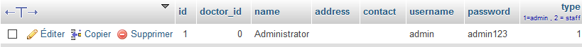

```
# Exploit Title: Loan Management System 1.0 - Cleartext Storage of Sensitive Information
# Date: 2020-09-26
# Exploit Author: Thibault Galbourdin (Liodeus)
# Vendor Homepage: https://www.sourcecodester.com/php/14471/loan-management-system-using-phpmysql-source-code.html
# Product Link: https://www.sourcecodester.com/download-code?nid=14471&title=Loan+Management+System+using+PHP%2FMySQL+with+Source+Code
# Tested on: Windows 10 + 7.4.10

# Description:
# An issue was discovered in Loan Management System 1.0. The application stores unencrypted 
# user passwords in a MySQL database. This could allow an attacker to retrieve all passwords
# and possibly gain elevated privileges.

# POC


```

