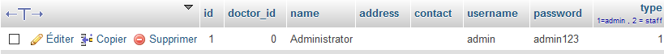

## Unencrypted password

SourceCodesters Loan Management System v1.0 stores unencrypted user passwords in an MySQL database. This could allow an attacker to retrieve all passwords and possibly gain elevated privileges.

*More informations to come*